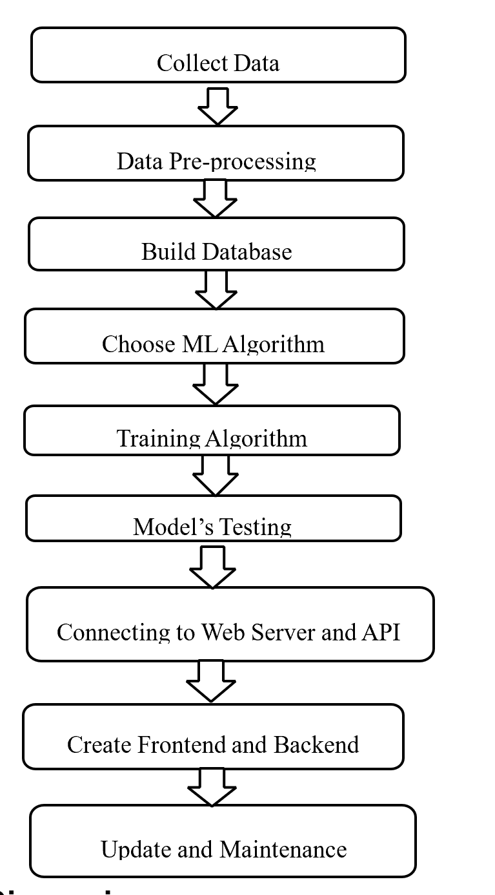
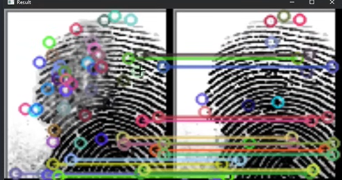

# 🔒 Fingerprint Matching Using AI in Python

This project demonstrates a secure, AI-driven fingerprint recognition system implemented in Python. It explores classical machine learning and deep learning models such as SVM, CNN, and Siamese Networks for accurate, fast, and scalable biometric authentication.

> 🧠 Focus: AI, ML, Pattern Recognition, Biometrics  
> 👤 Author: Yuvaraj – 2022504554  

---

## 🧠 Abstract

Fingerprint matching is one of the most widely used biometric authentication methods. This project integrates **AI techniques** with Python to build a fingerprint matching system that can:
- Compare fingerprint images
- Classify match vs. no-match
- Handle real-world noise and variations

It uses traditional **feature extraction** (minutiae, ridge flow) and modern **deep learning models** (CNNs, Siamese Networks) for robust performance.

---

## ⚙️ Technologies Used

- 🐍 Python 3.x
- 🧠 TensorFlow / Keras
- 🤖 OpenCV
- 📊 Scikit-learn
- 🖼️ FVC / SOCOFing Dataset

---

## 🧪 Methodology

1. **Data Collection** – Public datasets (Kaggle, NIST, SOCOFing)
2. **Preprocessing** – Grayscale, normalization, enhancement, filtering
3. **Feature Extraction**
   - Minutiae (ridges, bifurcations)
   - CNN-based auto-features
4. **Model Training**
   - SVM, Random Forest
   - CNN / Siamese Network
5. **Evaluation**
   - Accuracy, FAR, FRR, Precision/Recall

---

## 📁 Folder Structure
```
fingerprint-matching-ai/
├── fingerprint_matching.py
├── Fingerprint_Matching_Report.pdf
├── requirements.txt
├── dataset/
│ └── sample1.png, sample2.png
├── models/
│ └── cnn_model.h5
├── images/
│ ├── system_flowchart.jpg
│ └── matching_result.jpg
```


---

## 🧠 Sample Flowchart



---

## ✅ Results

- High-accuracy CNN-based model
- Siamese network for similarity matching
- Score-based output showing fingerprint pair match quality



---

## 📈 Future Scope

- 🔐 Multimodal biometrics (face + fingerprint + voice)
- 🧠 One-shot learning using Siamese Networks
- 🔍 Spoofing detection with AI
- 📱 Edge computing deployment (on-device recognition)
- 🧾 Explainable AI (XAI) for decision transparency

---

## 📚 References

- Jain, A. K., et al. Handbook of Biometrics, Springer.
- Goodfellow, I. – GANs for Fingerprint Matching
- Kaggle Dataset: [SOCOFing](https://www.kaggle.com/datasets/ruizgara/socofing)

---

## 👨‍🎓 Author

- **Yuvaraj V** – 2022504554  
-  MIT Campus, Anna University

---

## 🛡️ License

This project is shared for educational and academic use.

